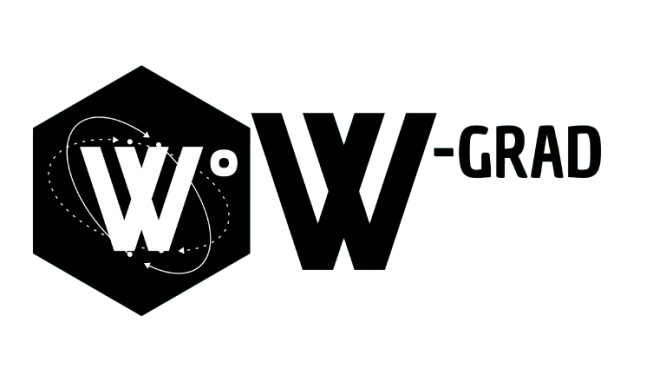

W° is a domain-specific language designed to handle the complexities of orbital mechanics and space computations. Whether you're working on interplanetary missions, orbital simulations, or just learning about space, W° offers a straightforward, intuitive syntax for space enthusiasts and professionals alike.

---

## Features

- **Orbital Mechanics Functions**: Built-in functions for computing orbital transfers, delta-v calculations, gravity assists, and more.
- **Intuitive Syntax**: A user-friendly language designed for easy adoption by those interested in space science.
- **High-Performance**: Optimized calculations to handle the physics of spaceflight, orbital mechanics, and celestial body simulations efficiently.
- **Real-Time Feedback**: Integrated with visual elements for tracking calculations and simulations in real-time.

---

## Applications

- **Mission Planning**: Calculate transfers, orbits, and fuel requirements for space missions.
- **Delta-V Calculations**: Perform critical delta-v calculations for orbital adjustments, launches, and interplanetary transfers.
- **Orbital Simulations**: Simulate satellite orbits, planetary motion, and space body interactions.
- **Educational Tools**: Learn and teach orbital mechanics with practical coding examples.

---

### First Script Example

Here’s an example of how you can use W° to calculate a simple Hohmann transfer between Earth and Mars:

```W-Grad
// Calculate Hohmann transfer from Earth to Mars
planet_1 = Earth;
planet_2 = Mars;

transfer = calculate_transfer(planet_1, planet_2, fuel=5000);

echo("Delta-V for Hohmann transfer:", transfer.delta_v);
echo("Transfer time:", transfer.time);

// Simulate orbital insertion around Earth
insert_orbit(planet_1, periapsis=300, apoapsis=400);


<p align="center" width="500" height="600">
    
</p>
<p align="center">
    
</p>


W° is a domain-specific language designed to handle the complexities of orbital mechanics and space computations. Whether you're working on interplanetary missions, orbital simulations, or just learning about space, W° offers a straightforward, intuitive syntax for space enthusiasts and professionals alike.

---

## Features

- **Orbital Mechanics Functions**: Built-in functions for computing orbital transfers, delta-v calculations, gravity assists, and more.
- **Intuitive Syntax**: A user-friendly language designed for easy adoption by those interested in space science.
- **High-Performance**: Optimized calculations to handle the physics of spaceflight, orbital mechanics, and celestial body simulations efficiently.
- **Real-Time Feedback**: Integrated with visual elements for tracking calculations and simulations in real-time.

---

## Applications

- **Mission Planning**: Calculate transfers, orbits, and fuel requirements for space missions.
- **Delta-V Calculations**: Perform critical delta-v calculations for orbital adjustments, launches, and interplanetary transfers.
- **Orbital Simulations**: Simulate satellite orbits, planetary motion, and space body interactions.
- **Educational Tools**: Learn and teach orbital mechanics with practical coding examples.

---

### First Script Example

Here’s an example of how you can use W° to calculate a simple Hohmann transfer between Earth and Mars:

```W-Grad
// Calculate Hohmann transfer from Earth to Mars
planet_1 = Earth;
planet_2 = Mars;

transfer = calculate_transfer(planet_1, planet_2, fuel=5000);

echo("Delta-V for Hohmann transfer:", transfer.delta_v);
echo("Transfer time:", transfer.time);

// Simulate orbital insertion around Earth
insert_orbit(planet_1, periapsis=300, apoapsis=400);
```

<p align="center"  >
    
</p>
